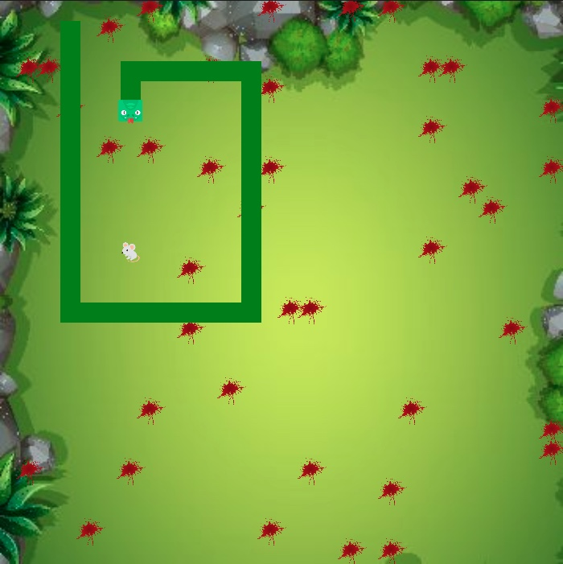

# Super Snake

A simple, entertaining, aesthetically and aubibly pleasing snake game!

## Website Preview

### Static Screenshot



## Index

1. [Description](#description)
2. [Usage](#usage)
3. [Features](#features)
4. [Technology](#technology)
5. [Contributing](#contributing)
6. [Resources](#resources)
7. [Credits](#credits)

## Description

```
AS a consumer of games

I WANT to play a simple, entertaining, aesthetically and aubibly pleasing game

SO THAT I can relax and have a good time
````

## Usage

This app is deployed using GitHub Pages . From a development perspective, this app uses JavaScript, CSS, HTML and p5.js. See the technology list below for more detail.

## Features

This game features two sprites, a snake(pcc) and a mouse(npc). The game starts using a mouse-click. Take control of the snake using the arrow keys on your keyboard after the game starts. Direct the snake to the mouse to eat it ("num-num", splatter), after eating the mouse the snake will grow. If you navigate the snake into the border or into its own tail the game is over and the sprites will be reset. You can pause the game using the spacebar.

## Technology

1. JavaScript
2. CSS
3. HTML
4. p5.js
5. Git/GitHub: Repo and version management.
6. GutHub Pages

## Contributing

Contributor Covenant Code of Conduct

[](https://www.contributor-covenant.org/version/2/1/code_of_conduct/code_of_conduct.md)

## Collaborators

1. [Patrick Ratcliff - GitHub Profile](https://github.com/PatrickARatcliff)

## Resources

1. GitHub Repo: <https://github.com/PatrickARatcliff/super_snake>
2. GutHub Pages URL: <https://patrickaratcliff.github.io/super_snake/>
3. p5.js web editor URL: <https://editor.p5js.org/PatrickARatcliff/full/0oFubilss>

## Credits

1. num.wav - mix.kit.co: <https://mixkit.co/free-sound-effects/eat/>
2. thrash_metal.mp3 - pixabay.com - Muzaproduction <https://muzaproduction.net/en/>: <https://pixabay.com/music/search/genre/metal/>
3. blood.png - pnegg.com: <https://www.pngegg.com/en/png-bbwtb/download>
4. field_bg.jpeg - freepik.com: <https://www.freepik.com/free-vector/aerial-view-garden-background_4613367.htm#query=grass%20birds%20eye%20view&position=5&from_view=keyword&track=ais>
5. mouse.svg - creazilla.com: <https://creazilla.com/nodes/7905998-emoji-u1f401-icon>
6. square_snake.svg - creazilla.com: <https://creazilla.com/nodes/3409824-square-animal-face-7-01-snake-icon>


